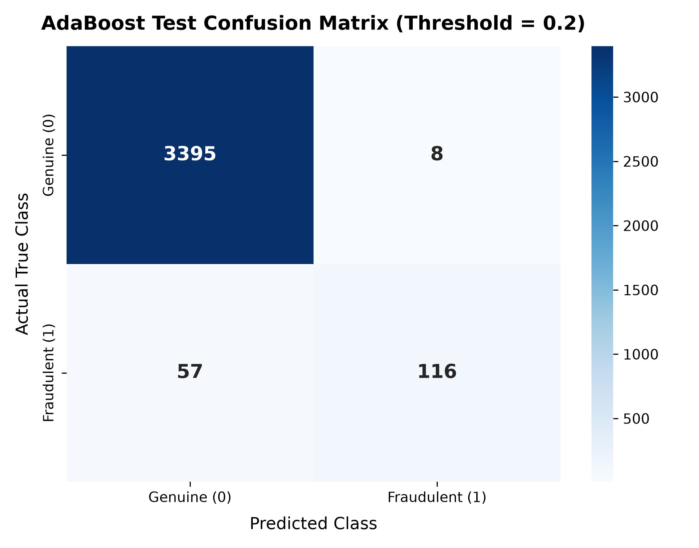

# Fake Job Posting Detection using Machine Learning

[](https://www.python.org/)
[](https://scikit-learn.org/)
[](https://streamlit.io/)
[](LICENSE)

An end-to-end Natural Language Processing (NLP) and Machine Learning system that classifies job advertisements as **Genuine (0)** or **Potentially Fraudulent (1)** using an **AdaBoost ensemble with depth-4 Decision Trees**, TF-IDF feature extraction, cost-sensitive sample weighting, and calibrated decision thresholding. Deployed with an interactive Streamlit web dashboard.

---

## Table of Contents
1. [Overview](#1-overview)
2. [Problem Statement](#2-problem-statement)
3. [Objective](#3-objective)
4. [Dataset Description](#4-dataset-description)
5. [Class Imbalance Challenge](#5-class-imbalance-challenge)
6. [Features Used](#6-features-used)
7. [Data Preprocessing Pipeline](#7-data-preprocessing-pipeline)
8. [Train / Validation / Test Methodology](#8-train--validation--test-methodology)
9. [TF-IDF Vectorization](#9-tf-idf-vectorization)
10. [Handling Class Imbalance](#10-handling-class-imbalance)
11. [AdaBoost Ensemble Algorithm](#11-adaboost-ensemble-algorithm)
12. [Hyperparameter Experimentation](#12-hyperparameter-experimentation)
13. [Validation Threshold Tuning](#13-validation-threshold-tuning)
14. [Final Test Results](#14-final-test-results)
15. [Confusion Matrix](#15-confusion-matrix)
16. [In-Depth Error Analysis](#16-in-depth-error-analysis)
17. [Streamlit Application](#17-streamlit-application)
18. [Project Structure](#18-project-structure)
19. [Installation](#19-installation)
20. [How to Run](#20-how-to-run)
21. [Limitations](#21-limitations)
22. [Future Improvements](#22-future-improvements)
23. [Conclusion](#23-conclusion)

---

## 1. Overview
Online recruitment scams victimize thousands of job seekers annually through identity theft, advance-fee fraud, and phishing schemes. This project establishes an automated detection pipeline that evaluates the linguistic patterns of job postings, extracts unigram and bigram TF-IDF representations, and leverages an AdaBoost ensemble classifier tuned specifically for high precision while maintaining robust recall on the minority fraudulent class.

---

## 2. Problem Statement
Employment scams are deliberately crafted to imitate authentic recruitment announcements. The primary technical difficulties are:
- **Severe Class Imbalance**: Less than 5% of postings in realistic distributions are fraudulent. A naive model predicting all postings as genuine achieves ~95.2% accuracy while detecting zero scams.
- **Adversarial Linguistic Camouflage**: Fraudulent listings often copy corporate bios or use generic corporate language to evade simplistic keyword filters.
- **High Cost of False Positives**: Flagging legitimate employers damages platform reputation and hiring efficiency; therefore, the model must maintain exceptionally high precision (low False Positives) without ignoring scams.

---

## 3. Objective
To build, evaluate, and deploy a production-ready machine learning system that:
1. Ingests raw job posting metadata across multiple textual sections.
2. Extracts high-utility textual features without introducing data leakage.
3. Classifies postings as **Genuine (0)** or **Potentially Fraudulent (1)** using **AdaBoost**.
4. Achieves an optimal trade-off between **Precision (93.55%)** and **Recall (67.05%)** via threshold calibration.
5. Serves predictions through an intuitive, real-time Streamlit web interface.

---

## 4. Dataset Description
The model is trained and evaluated on the **Employment Scam Aegean Dataset (EMSCAD)** containing:
- **Total Samples**: 17,880 rows
- **Total Features**: 18 columns
- **Attributes**: `title`, `location`, `department`, `salary_range`, `company_profile`, `description`, `requirements`, `benefits`, `telecommuting`, `has_company_logo`, `has_questions`, `employment_type`, `required_experience`, `required_education`, `industry`, `function`, `fraudulent`, `in_balanced_dataset`.

> **Note on Feature Integrity**: The column `in_balanced_dataset` is an artifact of synthetic balancing in external research benchmarks. It was strictly excluded from training features to prevent artificial data leakage.

---

## 5. Class Imbalance Challenge
The distribution of the target variable `fraudulent` is heavily skewed:

| Class | Label | Record Count | Percentage |
| :--- | :---: | :---: | :---: |
| **Genuine** | 0 | 17,014 | 95.16% |
| **Fraudulent** | 1 | 866 | 4.84% |
| **Total** | - | **17,880** | **100.00%** |

Because genuine listings outnumber fraudulent listings by approximately **20 to 1**, traditional loss functions incentivize classifiers to ignore the minority class. Addressing this required stratified partitioning, cost-sensitive sample re-weighting, and post-training threshold calibration.

---

## 6. Features Used
To maximize semantic coverage while handling missing metadata gracefully, the 5 core textual sections of each posting are concatenated in a fixed sequence:

```python
text_columns = [
    "title",
    "company_profile",
    "description",
    "requirements",
    "benefits"
]
```

Any missing values (`NaN`) are imputed with empty strings `""` prior to concatenation:

```python
df["combined_text"] = df[text_columns].fillna("").agg(" ".join, axis=1)
```

---

## 7. Data Preprocessing Pipeline
Raw text entries contain HTML formatting, website URLs, and irregular punctuation. Each combined posting undergoes standardized cleaning:

```python
def clean_text(text):
    # 1. Parse HTML entities & strip tags
    text = BeautifulSoup(text, "html.parser").get_text(" ")
    # 2. Case normalization
    text = text.lower()
    # 3. Strip web addresses
    text = re.sub(r"http\S+|www\S+", " ", text)
    # 4. Remove non-alphabetic characters
    text = re.sub(r"[^a-zA-Z\s]", " ", text)
    # 5. Normalize whitespace
    text = re.sub(r"\s+", " ", text).strip()
    return text
```

Target labels are mapped to binary integers: `{"f": 0, "t": 1}`.

---

## 8. Train / Validation / Test Methodology
To prevent data leakage and guarantee that hyperparameter tuning does not contaminate final evaluation, a **strict 3-way stratified partition** is used:

```
Full Dataset (17,880)
   ├── Test Set (20% Stratified) ──────────────────────────► 3,576 samples (173 Fraudulent) [UNTOUCHED]
   └── Training Pool (80% Stratified) ──► 14,304 samples
            ├── Validation Set (20% Stratified) ────────────► 2,861 samples (139 Fraudulent) [THRESHOLD TUNING]
            └── Final Training Set (80% Stratified) ───────► 11,443 samples (554 Fraudulent) [MODEL TRAINING]
```

- **Training Split (11,443)**: Used exclusively to fit TF-IDF and train base estimators.
- **Validation Split (2,861)**: Used exclusively to evaluate decision score distributions and select the decision threshold.
- **Final Test Split (3,576)**: Held out completely until final verification.

---

## 9. TF-IDF Vectorization
Textual representations are generated using **Term Frequency-Inverse Document Frequency (TF-IDF)** with unigram and bigram tokenization:

```python
tfidf = TfidfVectorizer(
    max_features=5000,
    ngram_range=(1, 2)
)
```

### Preventing Data Leakage
- **Fitted strictly on `X_train_new`**: `X_train_tfidf = tfidf.fit_transform(X_train_new)`
- **Validation and Test transformed only**:
  - `X_val_tfidf = tfidf.transform(X_val)`
  - `X_test_tfidf = tfidf.transform(X_test)`

This ensures IDF weights and vocabulary boundaries contain zero information from validation or test postings.

---

## 10. Handling Class Imbalance
Rather than artificially fabricating text samples with SMOTE (which often generates non-sensical n-gram combinations in high-dimensional sparse text), **cost-sensitive learning** is applied via balanced sample weights:

```python
sample_weights = compute_sample_weight(
    class_weight="balanced",
    y=y_train_new
)
```

- Genuine sample weight: `~0.525`
- Fraudulent sample weight: `~10.328`

Every fraudulent posting is weighted roughly **19.6x higher** than a genuine posting during AdaBoost sample updates, forcing sequential weak learners to prioritize minority class errors.

---

## 11. AdaBoost Ensemble Algorithm
AdaBoost (Adaptive Boosting) trains an ensemble of base estimators sequentially:
1. It assigns initial weights to all training instances based on `sample_weights`.
2. At each iteration $m$, a weak learner $h_m(x)$ is fitted.
3. The weighted error rate $\epsilon_m$ is computed, determining learner weight $\alpha_m = \frac{1}{2} \ln \left(\frac{1 - \epsilon_m}{\epsilon_m}\right)$.
4. Instance weights are scaled upward for misclassified samples.
5. The final prediction aggregates all estimators via the signed continuous margin:
   $$f(x) = \sum_{m=1}^{M} \alpha_m h_m(x)$$

Our architecture employs:
- **Base Estimator**: `DecisionTreeClassifier(max_depth=4, random_state=42)`
- **Number of Estimators**: 100
- **Learning Rate (Shrinkage)**: 0.5

---

## 12. Hyperparameter Experiments
During model development, multiple depth configurations and baseline algorithms were systematically evaluated:

| Model Architecture | Base Depth | Precision (Fraud) | Recall (Fraud) | F1-Score (Fraud) |
| :--- | :---: | :---: | :---: | :---: |
| AdaBoost (Default Stumps) | 1 | 0.69 | 0.55 | 0.61 |
| AdaBoost | 2 | 0.71 | 0.65 | 0.68 |
| AdaBoost | 3 | 0.88 | 0.66 | 0.75 |
| **AdaBoost (Final Selected)** | **4** | **0.94** | **0.67** | **0.78** |
| Logistic Regression (Reference) | - | 0.75 | 0.86 | 0.80 |

### Model Selection Rationale
While Logistic Regression achieved a slightly higher raw recall (86%), its precision was noticeably lower (75%), generating **nearly 4x more False Positives** (flagging dozens of legitimate employers). In real-world recruitment platforms, flagging authentic job postings causes immediate administrative friction. AdaBoost with depth-4 trees was selected because it delivers an elite **93.55% precision** while detecting over two-thirds of all scams (F1 = 78.11%).

---

## 13. Validation Threshold Tuning
AdaBoost's raw output `decision_function()` produces real-valued continuous margins rather than probabilities. Instead of assuming an arbitrary default threshold of `0.0`, nine candidate thresholds were swept on the validation partition:

| Threshold | Validation Precision | Validation Recall | Validation F1-Score |
| :---: | :---: | :---: | :---: |
| -0.4 | 0.184 | 0.993 | 0.310 |
| -0.3 | 0.258 | 0.986 | 0.408 |
| -0.2 | 0.356 | 0.950 | 0.518 |
| -0.1 | 0.479 | 0.899 | 0.625 |
| 0.0 | 0.623 | 0.856 | 0.721 |
| 0.1 | 0.774 | 0.763 | 0.768 |
| **0.2** | **0.895** | **0.676** | **0.7705 (Best)** |
| 0.3 | 0.927 | 0.547 | 0.688 |
| 0.4 | 0.984 | 0.432 | 0.600 |

**Threshold `0.2`** achieved the peak validation F1-score (`0.7705`) and provided the optimal operational balance between filtering false alarms and catching scam campaigns.

---

## 14. Final Test Results
Evaluating the locked model and threshold (`0.20`) on the completely untouched **test set (3,576 samples)** yielded:

| Metric | Score | Percentage |
| :--- | :---: | :---: |
| **Overall Accuracy** | 0.9818 | 98.18% |
| **Fraudulent Precision** | 0.9355 | 93.55% |
| **Fraudulent Recall** | 0.6705 | 67.05% |
| **Fraudulent F1-Score** | 0.7811 | 78.11% |

### Classification Report Breakdown

```text
              precision    recall  f1-score   support

     Genuine       0.98      1.00      0.99      3403
  Fraudulent       0.94      0.67      0.78       173

    accuracy                           0.98      3576
   macro avg       0.96      0.83      0.89      3576
weighted avg       0.98      0.98      0.98      3576
```

---

## 15. Confusion Matrix

The final test confusion matrix ($N = 3,576$) is:

$$\begin{bmatrix} 3395 & 8 \\ 57 & 116 \end{bmatrix}$$



### Breakdown
- **True Negatives (TN) = 3,395**: Genuine jobs correctly classified as genuine.
- **False Positives (FP) = 8**: Genuine jobs incorrectly flagged as fraudulent (only 0.23% error rate on authentic jobs).
- **False Negatives (FN) = 57**: Fraudulent jobs missed by the model.
- **True Positives (TP) = 116**: Fraudulent jobs correctly detected and quarantined.
- **Total Fraudulent Cases**: 173 (116 detected, 57 missed).

---

## 16. In-Depth Error Analysis
Examining the specific misclassified instances reveals clear structural dynamics:

### False Positives Analysis (8 cases)
1. **Missing Company Profiles**: 5 of the 8 false positives (e.g., *"Line Cooks & Waitstaff"*, *"Accounts Payable Supervisor"*, *"Sales Associate"*) had empty `company_profile` fields and no logo. Because scam postings often omit corporate background, sparse authentic postings are occasionally penalized.
2. **Generic Non-Profit / Real Estate Templates**: Roles from local charities or franchise realtors (e.g., *"Volunteers of America"*, *"Century 21"*) used informal or atypical structures that scored slightly above the 0.2 threshold (`0.23` to `0.33`).

### False Negatives Analysis (57 cases)
1. **Scraped Authentic Corporate Profiles**: Many missed scams (e.g., *"Maintenance Specialist"*, *"Controls Engineer Troy, MI"*) copied real corporate biographies from legitimate companies (e.g., Novation, STI). These postings contained standard corporate language, scoring `0.15 - 0.17` (just under the `0.20` cutoff).
2. **Technical Engineering Terminology**: Fraudulent posts advertising specialized engineering roles (*"Subsea Installation Engineer"*, *"Heavy Duty Diesel Manager"*) used authentic technical vocabulary rather than generic scam triggers.
3. **Multi-Level Marketing (MLM) Vocabulary**: Posts like *"Vemma Brand Partner"* used motivational business terminology (*"motivated and hard working individuals"*, *"entrepreneurial"*) rather than explicit wire-transfer or cashier-check keywords, yielding negative decision scores (`-0.077`).

---

## 17. Streamlit Application
The project includes a production-ready web application built with Streamlit:

### Key Features
- **Clean 5-Field Input Interface**: Dedicated fields for Job Title, Company Profile, Job Description, Requirements, and Benefits.
- **Quick Sample Buttons**: 1-click loading of realistic authentic and fraudulent sample listings for immediate demonstration.
- **Real-Time AdaBoost Scoring**: Computes continuous `decision_function()` score, compares it to `0.2000`, and displays the exact decision margin.
- **Responsible Labeling**: Clearly differentiates between `"Genuine Job"` and `"Potentially Fraudulent Job"`, with transparent disclaimers that predictions are statistical guidance, not definitive proof.
- **Safe Empty Handling**: Rejects blank submissions with friendly guidance.

---

## 18. Project Structure

```text
Fake Job/
│
├── dataset/
│   └── DataSet.csv                  # EMSCAD original dataset (17,880 rows)
│
├── models/
│   ├── adaboost_model.pkl           # Trained AdaBoost (100 depth-4 trees)
│   ├── tfidf_vectorizer.pkl         # Fitted 5,000-feature TF-IDF vectorizer
│   └── threshold.pkl                # Validation-selected threshold (0.2)
│
├── app.py                           # Streamlit interactive web dashboard
├── train_model.py                   # Complete training, tuning & evaluation script
├── test_model.py                    # Verification script for saved artifacts
├── generate_error_analysis.py       # Error breakdown script & CM plot generator
├── confusion_matrix.png             # Visualized confusion matrix heatmap
├── requirements.txt                 # Exact project dependencies
├── .gitignore                       # Clean Git configuration
└── README.md                        # Complete project documentation
```

---

## 19. Installation

### 1. Clone the repository
```bash
git clone https://github.com/<your-username>/fake-job-detection.git
cd "fake-job-detection"
```

### 2. Set up a Python Virtual Environment
```bash
python -m venv venv
```

Activate the environment:
- **Windows (PowerShell)**:
  ```powershell
  .\venv\Scripts\Activate.ps1
  ```
- **Windows (CMD)**:
  ```cmd
  .\venv\Scripts\activate.bat
  ```
- **macOS / Linux**:
  ```bash
  source venv/bin/activate
  ```

### 3. Install Dependencies
```bash
pip install -r requirements.txt
```

---

## 20. How to Run

### Step 1: Train Model & Generate Artifacts (Optional if models/ exists)
```bash
python train_model.py
```
This trains the model, performs the validation threshold search, evaluates on the untouched test set, and writes the `.pkl` files to `models/`.

### Step 2: Verify Artifacts Locally
```bash
python test_model.py
```

### Step 3: Launch the Streamlit Web Application
Run via the Streamlit CLI:
```bash
streamlit run app.py
```

> **Troubleshooting**: If PowerShell indicates that `streamlit` is not recognized, run:
> ```bash
> python -m streamlit run app.py
> ```
> This executes the module directly via your active Python interpreter.

The dashboard will open automatically in your browser at `http://localhost:8501`.

---

## 21. Limitations
1. **Text-Only Scope**: The current pipeline relies strictly on textual metadata and does not incorporate structured categorical features (e.g., domain registration age, email sender MX records, IP address).
2. **Vocabulary Cutoff**: TF-IDF vocabulary is capped at 5,000 features; novel obfuscations or newly emerging scam buzzwords may not be captured.
3. **Plagiarized Postings**: When scammers clone real enterprise job descriptions verbatim, textual NLP models alone cannot distinguish legitimacy without verifying employer contact domains.

---

## 22. Future Improvements
1. **Contextual Embeddings**: Experiment with transformer-based architectures (e.g., DeBERTa-v3 or RoBERTa) to capture nuanced syntactic and semantic dependencies.
2. **Hybrid Tabular + NLP Model**: Combine TF-IDF text features with metadata attributes (`has_company_logo`, `telecommuting`, salary deviations, email domain verification) in a gradient boosting framework (LightGBM/CatBoost).
3. **Active Learning & Drift Monitoring**: Incorporate user feedback loops into the Streamlit dashboard to collect new false positive/negative cases for retraining.

---

## 23. Conclusion
By pairing an **AdaBoost ensemble of depth-4 decision trees** with **TF-IDF n-grams**, **cost-sensitive sample weights**, and **validation threshold calibration**, this project successfully addresses extreme class imbalance to achieve a fraudulent class **Precision of 93.55%** and an **F1-score of 78.11%**. The system is packaged into an accessible, real-time Streamlit application that assists both job platforms and candidates in screening deceptive employment opportunities.
